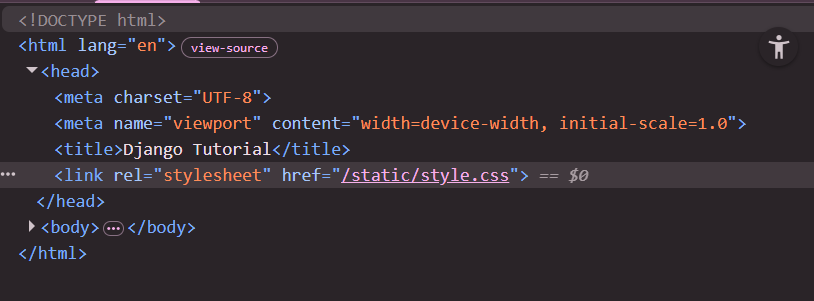
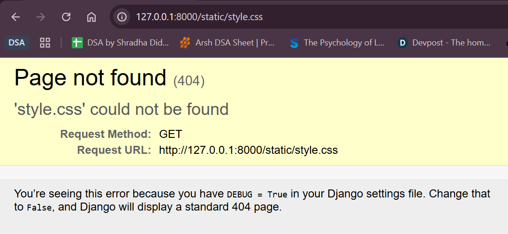

# 1. Starting a Django project
```python
django-admin startproject <project-name> [directory]
```
# 2. Running it
```python
cd <project-name>
python manage.py runserver 8000 (by default)
```
# 3. How to use Templates?
- My root directory is djangotut, project folder is mysite
- Make a folder 'templates' right inside the root directory, and 'static' folder too inside the root directory where you will store your css and javascript
- html file go under templates

## 3.1 Importing in views.py
    ```python
    from django.shortcuts import render
    return render(request, 'index.html')
    ```
- here the 'index.html' will be directly searched for inside the templates folder 

## 3.2 Configure settings.py
- To load templates, go in settings.py and add the Directory where templates exist
```python
'DIRS': ['templates'],
```
(coz they are already in the root directory)

## 3.3 Configure static and load custom css styles
- You cannot directory load styles.css in index.html from another folder outside "../../static/styles.css" doesn't work
- <h1> Templating Engine </h1> : that html file works as the whole templating engine. means you can "inject" your code into the file.

### 3.3.1 How to Inject?
- 
```python
<link rel="stylesheet" href="">
```
also you need to load the static at the top of html 
```python

```
this is also templating engine
Now if you'll see in inspect code, it's trying to call style.css from static inside the current folder but there doesn't exist any



### 3.3.2 configure in settings.py
```python
import os

STATIC_URL = 'static/'
STATICFILES_DIRS = [os.path.join(BASE_DIR, 'static')]
``` 
PRO-tip : download django extension

# 4. Variables
- Use {{variable-name}} in django

# 5. Apps
- A project can contain multiple apps
- you only create a project once but can have multiple apps inside it.
```python
python manage.py startapp <app-name>
```
- The first step after making an app is to make our main project aware about this new app. 

## 5.1 Configure settings.py
- there are already cooked-in apps in django (built-in (default) apps — the ones that come bundled when you create a new project)
- go to settings.py in your project folder
- Add 'chai' under INSTALLED_APPS
```python
INSTALLED_APPS = [
    'django.contrib.admin',
    'django.contrib.auth',
    'django.contrib.contenttypes',
    'django.contrib.sessions',
    'django.contrib.messages',
    'django.contrib.staticfiles',
    'chai',
]
```
- “Django, please load this app and include its models, migrations, signals, templates, and configuration into the project.” 
- If you don’t add it there, Django ignores the app completely. It’s like creating a room in your house but never connecting electricity to it.

- You don't need to load templates into the settings again. That's a bonus. You can have templates individually for each app in that app or you can make a separate folder in the main project's template folder with your app. Both works. However, adding a template folder in the app itself might be more-used industry standard.

## 5.2 Adding urls.py
- you must have noticed, there's no urls.py in the app folder. there's not - you need to create one. copy paste from the main project - doesn't matter honestly - do it and make a urls.py in your app folder. 
- this urls.py is a sub-url. 
- to share control from the main-project to the app:
project-folder urls.py (main project)
```python
from django.urls import path,include
urlpatterns = [
    path('chai/',include('chai.urls')),
]
```
- whenever u git chai url, then control will be transferred to an app.
- and include urls in chai. control transferred.
- and your app has been included in your project

# 6. Layout file